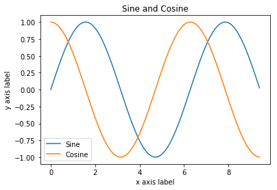
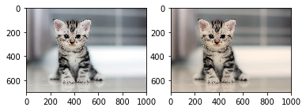

### Rewritten the whole code 


```python
def quicksort(eip_list):
    if len(eip_list)<=1:
        return eip_list
    eip_pivot = eip_list[len(eip_list)//2]
    eip_left = [eip for eip in eip_list if eip < eip_pivot]
    eip_middle = [eip for eip in eip_list if eip == eip_pivot]
    eip_right = [eip for eip in eip_list if eip > eip_pivot]
    return quicksort(eip_left) + eip_middle + quicksort(eip_right)
```


```python
quicksort([3,4,5,1])
```


    [1, 3, 4, 5]


```python
eip_in = 3
print(type(eip_in))
print(eip_in)       
print(eip_in + 1)   
print(eip_in - 1)   
print(eip_in * 2)   
print(eip_in ** 2)  
eip_in += 1
print(eip_in)  
eip_in *= 2
print(eip_in)  
eip_out = 2.5
print(type(eip_out)) 
print(eip_out, eip_out + 1, eip_out * 2, eip_out ** 2)
```

    <class 'int'>
    3
    4
    2
    6
    9
    4
    8
    <class 'float'>
    2.5 3.5 5.0 6.25


```python
mlblr_in = True
mlblr_out = False
print(type(mlblr_in)) 
print(mlblr_in and mlblr_out) 
print(mlblr_in or mlblr_out)  
print(not mlblr_in)   
print(mlblr_in != mlblr_out)  
```

    <class 'bool'>
    False
    True
    False
    True


```python
eip = 'hello'    
mlblr = "world"    
print(eip)       
print(len(eip))  
hw = eip + ' ' + mlblr  
print(hw)  
eip_in = '%s %s %d' % (eip, mlblr, 12)  
print(eip_in)  
```

    hello
    5
    hello world
    hello world 12


```python
mlblr = "hello"
print(mlblr.capitalize())  
print(mlblr.upper())       
print(mlblr.rjust(7))      
print(mlblr.center(7))     
print(mlblr.replace('l', '(ell)'))     
print('  world '.strip())  
```

    Hello
    HELLO
      hello
     hello 
    he(ell)(ell)o
    world


```python
eip_list = [3, 1, 2]    
print(eip_list, eip_list[2])  
print(eip_list[-1])     
eip_list[2] = 'foo'     
print(eip_list)         
eip_list.append('bar')  
print(eip_list)         
eip = eip_list.pop()      
print(eip, eip_list)      
```

    [3, 1, 2] 2
    2
    [3, 1, 'foo']
    [3, 1, 'foo', 'bar']
    bar [3, 1, 'foo']


```python
eip_list = list(range(5))     
print(eip_list)               
print(eip_list[2:4])          
print(eip_list[2:])           
print(eip_list[:2])           
print(eip_list[:])            
print(eip_list[:-1])          
eip_list[2:4] = [8, 9]        
print(eip_list)               
```

    [0, 1, 2, 3, 4]
    [2, 3]
    [2, 3, 4]
    [0, 1]
    [0, 1, 2, 3, 4]
    [0, 1, 2, 3]
    [0, 1, 8, 9, 4]


```python
eip_list = ['cat', 'dog', 'monkey']
for mlblr_in in eip_list:
    print(mlblr_in)
```

    cat
    dog
    monkey


```python
mlblr = ['cat', 'dog', 'monkey']
for eip_in, eip_out in enumerate(mlblr):
    print('#%d: %s' % (eip_in + 1, eip_out))
```

    #1: cat
    #2: dog
    #3: monkey


```python
mlblr = [0, 1, 2, 3, 4]
eip_list = []
for eip in mlblr:
    eip_list.append(eip ** 2)
print(eip_list)   
```

    [0, 1, 4, 9, 16]


```python
mlblr = [0, 1, 2, 3, 4]
eip_list = [eip ** 2 for eip in mlblr]
print(eip_list)   
```

    [0, 1, 4, 9, 16]


```python
eip_in = [0, 1, 2, 3, 4]
eip_out = [eip ** 2 for eip in eip_in if eip % 2 == 0]
print(eip_out)
```

    [0, 4, 16]


```python
eip_dict = {'cat': 'cute', 'dog': 'furry'}  
print(eip_dict['cat'])       
print('cat' in eip_dict)     
eip_dict['fish'] = 'wet'     
print(eip_dict['fish'])      
print(eip_dict.get('monkey', 'N/A'))  
print(eip_dict.get('fish', 'N/A'))    
del eip_dict['fish']         
print(eip_dict.get('fish', 'N/A'))
```

    cute
    True
    wet
    N/A
    wet
    N/A


```python
eip_dict = {'person': 2, 'cat': 4, 'spider': 8}
for eip_in in eip_dict:
    legs = eip_dict[eip_in]
    print('A %s has %d legs' % (eip_in, legs))
```

    A person has 2 legs
    A cat has 4 legs
    A spider has 8 legs


```python
mlblr = [0, 1, 2, 3, 4]
mlblr_in = {eip: eip ** 2 for eip in mlblr if eip % 2 == 0}
print(mlblr_in)
```

    {0: 0, 2: 4, 4: 16}


```python
eip_dict = {'cat', 'dog'}
print('cat' in eip_dict)   
print('fish' in eip_dict)  
eip_dict.add('fish')       
print('fish' in eip_dict)  
print(len(eip_dict))     
eip_dict.add('cat')      
print(len(eip_dict))     
eip_dict.remove('cat')   
print(len(eip_dict))     
```

    True
    False
    True
    3
    3
    2


```python
eip_dict = {'cat', 'dog', 'fish'}
for eip_in, eip_out in enumerate(eip_dict):
    print('#%d: %s' % (eip_in + 1, eip_out))
```

    #1: dog
    #2: cat
    #3: fish


```python
from math import sqrt
mlblr_dict = {int(sqrt(eip)) for eip in range(30)}
print(mlblr_dict)
```

    {0, 1, 2, 3, 4, 5}


```python
eip_dict = {(eip, eip + 1): eip for eip in range(10)}  
eip_in = (5, 6)        
print(type(eip_in))    
print(eip_dict[eip_in])       
print(eip_dict[(1, 2)])
```

    <class 'tuple'>
    5
    1


```python
def sign(eip_in):
    if eip_in > 0:
        return 'positive'
    elif eip_in < 0:
        return 'negative'
    else:
        return 'zero'

for eip in [-1, 0, 1]:
    print(sign(eip))
```

    negative
    zero
    positive


```python
def hello(eip_in, mlblr_in=False):
    if mlblr_in:
        print('HELLO, %s!' % eip_in.upper())
    else:
        print('Hello, %s' % eip_in)

hello('Bob') # Prints "Hello, Bob"
hello('Fred', mlblr_in=True)
```

    Hello, Bob
    HELLO, FRED!


```python
class Greeter(object):

    def __init__(self, eip_in):
        self.eip_in = eip_in

    def greet(self, mlblr_in=False):
        if mlblr_in:
            print('HELLO, %s!' % self.eip_in.upper())
        else:
            print('Hello, %s' % self.eip_in)

g = Greeter('Fred')  
g.greet()            
g.greet(mlblr_in=True)   
```

    Hello, Fred
    HELLO, FRED!


```python
import numpy as np

eip_in = np.array([1, 2, 3])
print(type(eip_in))            
print(eip_in.shape)            
print(eip_in[0], eip_in[1], eip_in[2])   
eip_in[0] = 5                  
print(eip_in)                  

eip_out = np.array([[1,2,3],[4,5,6]])    
print(eip_out.shape)                     
print(eip_out[0, 0], eip_out[0, 1], eip_out[1, 0])
```

    <class 'numpy.ndarray'>
    (3,)
    1 2 3
    [5 2 3]
    (2, 3)
    1 2 4


```python
import numpy as np

eip = np.zeros((2,2))   
print(eip)             

eip_in = np.ones((1,2))   
print(eip_in)             

eip_out = np.full((2,2), 7) 
print(eip_out)              
                      

mlblr = np.eye(2)         
print(mlblr)              
                      

mlblr_in = np.random.random((2,2))  
print(mlblr_in)
```

    [[0. 0.]
     [0. 0.]]
    [[1. 1.]]
    [[7 7]
     [7 7]]
    [[1. 0.]
     [0. 1.]]
    [[0.47402308 0.77997697]
     [0.48571884 0.80859964]]


```python
import numpy as np

eip = np.array([[1,2,3,4], [5,6,7,8], [9,10,11,12]])
eip_in = eip[:2, 1:3]
print(eip[0, 1])   
eip_in[0, 0] = 77     
print(eip[0, 1])  
```

    2
    77


```python
import numpy as np


mlblr = np.array([[1,2,3,4], [5,6,7,8], [9,10,11,12]])

eip_in = mlblr[1, :]
eip_out = mlblr[1:2, :]  
print(eip_in, eip_in.shape)  
print(eip_out, eip_out.shape)  
mlblr_in = mlblr[:, 1]
mlblr_out = mlblr[:, 1:2]
print(mlblr_in, mlblr_in.shape)  
print(mlblr_out, mlblr_out.shape) 
```

    [5 6 7 8] (4,)
    [[5 6 7 8]] (1, 4)
    [ 2  6 10] (3,)
    [[ 2]
     [ 6]
     [10]] (3, 1)


```python
import numpy as np

eip = np.array([[1,2], [3, 4], [5, 6]])
print(eip[[0, 1, 2], [0, 1, 0]])
print(np.array([eip[0, 0], eip[1, 1], eip[2, 0]]))
print(eip[[0, 0], [1, 1]])
print(np.array([eip[0, 1], eip[0, 1]]))
```

    [1 4 5]
    [1 4 5]
    [2 2]
    [2 2]


```python
import numpy as np

mlblr = np.array([[1,2,3], [4,5,6], [7,8,9], [10, 11, 12]])

print(mlblr)
eip = np.array([0, 2, 0, 1])
print(mlblr[np.arange(4), eip])  
mlblr[np.arange(4), eip] += 10
print(mlblr)
```

    [[ 1  2  3]
     [ 4  5  6]
     [ 7  8  9]
     [10 11 12]]
    [ 1  6  7 11]
    [[11  2  3]
     [ 4  5 16]
     [17  8  9]
     [10 21 12]]


```python
import numpy as np

eip = np.array([[1,2], [3, 4], [5, 6]])
mlblr_in = (eip > 2)   
print(mlblr_in)      
print(eip[mlblr_in])  
print(eip[eip > 2])     
```

    [[False False]
     [ True  True]
     [ True  True]]
    [3 4 5 6]
    [3 4 5 6]


```python
import numpy as np

eip = np.array([1, 2])   
print(eip.dtype)         

mlblr = np.array([1.0, 2.0])   
print(mlblr.dtype)             

mlblr_in = np.array([1, 2], dtype=np.int64)   
print(mlblr_in.dtype)                         
```

    int64
    float64
    int64


```python
import numpy as np

eip = np.array([[1,2],[3,4]], dtype=np.float64)
mlblr = np.array([[5,6],[7,8]], dtype=np.float64)
print(eip + mlblr)
print(np.add(eip, mlblr))
print(eip - mlblr)
print(np.subtract(eip, mlblr))
print(eip * mlblr)
print(np.multiply(eip, mlblr))
print(eip / mlblr)
print(np.divide(eip, mlblr))
print(np.sqrt(eip))
```

    [[ 6.  8.]
     [10. 12.]]
    [[ 6.  8.]
     [10. 12.]]
    [[-4. -4.]
     [-4. -4.]]
    [[-4. -4.]
     [-4. -4.]]
    [[ 5. 12.]
     [21. 32.]]
    [[ 5. 12.]
     [21. 32.]]
    [[0.2        0.33333333]
     [0.42857143 0.5       ]]
    [[0.2        0.33333333]
     [0.42857143 0.5       ]]
    [[1.         1.41421356]
     [1.73205081 2.        ]]


```python
import numpy as np

eip = np.array([[1,2],[3,4]])
mlblr = np.array([[5,6],[7,8]])

eip_in = np.array([9,10])
mlblr_in = np.array([11, 12])

print(eip_in.dot(mlblr_in))
print(np.dot(eip_in, mlblr_in))
print(eip.dot(eip_in))
print(np.dot(eip, eip_in))
print(eip.dot(mlblr))
print(np.dot(eip, mlblr))
```

    219
    219
    [29 67]
    [29 67]
    [[19 22]
     [43 50]]
    [[19 22]
     [43 50]]


```python
import numpy as np

eip = np.array([[1,2],[3,4]])

print(np.sum(eip))  
print(np.sum(eip, axis=0))  
print(np.sum(eip, axis=1))  
```

    10
    [4 6]
    [3 7]


```python
import numpy as np

eip = np.array([[1,2], [3,4]])
print(eip)    
print(eip.T)  
mlblr = np.array([1,2,3])
print(mlblr)    
print(mlblr.T)  
```

    [[1 2]
     [3 4]]
    [[1 3]
     [2 4]]
    [1 2 3]
    [1 2 3]


```python
import numpy as np

eip = np.array([[1,2,3], [4,5,6], [7,8,9], [10, 11, 12]])
mlblr = np.array([1, 0, 1])
eip_in = np.empty_like(eip)   
for i in range(4):
    eip_in[i, :] = eip[i, :] + mlblr
print(eip_in)
```

    [[ 2  2  4]
     [ 5  5  7]
     [ 8  8 10]
     [11 11 13]]


```python
import numpy as np

eip = np.array([[1,2,3], [4,5,6], [7,8,9], [10, 11, 12]])
mlblr = np.array([1, 0, 1])
mlblr_in = np.tile(mlblr, (4, 1))
print(mlblr_in)
y = eip + mlblr_in
print(y)
```

    [[1 0 1]
     [1 0 1]
     [1 0 1]
     [1 0 1]]
    [[ 2  2  4]
     [ 5  5  7]
     [ 8  8 10]
     [11 11 13]]


```python
import numpy as np

eip = np.array([[1,2,3], [4,5,6], [7,8,9], [10, 11, 12]])
mlblr = np.array([1, 0, 1])
eip_in = eip + mlblr
print(eip_in)
```

    [[ 2  2  4]
     [ 5  5  7]
     [ 8  8 10]
     [11 11 13]]


```python
import numpy as np

eip = np.array([1,2,3])  
mlblr = np.array([4,5])
print(np.reshape(eip, (3, 1)) *mlblr)


eip_in = np.array([[1,2,3], [4,5,6]])
print(eip_in + eip)
print((eip_in.T + mlblr).T)
print(eip_in + np.reshape(mlblr, (2, 1)))
print(eip_in * 2)
```

    [[ 4  5]
     [ 8 10]
     [12 15]]
    [[2 4 6]
     [5 7 9]]
    [[ 5  6  7]
     [ 9 10 11]]
    [[ 5  6  7]
     [ 9 10 11]]
    [[ 2  4  6]
     [ 8 10 12]]


```python
from scipy.misc import imread, imsave, imresize


eip = imread('assets/cat.jpg')
print(eip.dtype, eip.shape)
mlblr = eip * [1, 0.95, 0.9]
mlblr = imresize(mlblr, (300, 300))
imsave('assets/cat_tinted.jpg', mlblr)
```

    uint8 (700, 1000, 3)


    /Users/abhilash/anaconda2/envs/DL/lib/python3.6/site-packages/ipykernel_launcher.py:4: DeprecationWarning: `imread` is deprecated!
    `imread` is deprecated in SciPy 1.0.0, and will be removed in 1.2.0.
    Use ``imageio.imread`` instead.
      after removing the cwd from sys.path.
    /Users/abhilash/anaconda2/envs/DL/lib/python3.6/site-packages/ipykernel_launcher.py:7: DeprecationWarning: `imresize` is deprecated!
    `imresize` is deprecated in SciPy 1.0.0, and will be removed in 1.2.0.
    Use ``skimage.transform.resize`` instead.
      import sys
    /Users/abhilash/anaconda2/envs/DL/lib/python3.6/site-packages/ipykernel_launcher.py:8: DeprecationWarning: `imsave` is deprecated!
    `imsave` is deprecated in SciPy 1.0.0, and will be removed in 1.2.0.
    Use ``imageio.imwrite`` instead.
      


```python
import numpy as np
from scipy.spatial.distance import pdist, squareform


eip = np.array([[0, 1], [1, 0], [2, 0]])
print(eip)
mlblr = squareform(pdist(eip, 'euclidean'))
print(mlblr)
```

    [[0 1]
     [1 0]
     [2 0]]
    [[0.         1.41421356 2.23606798]
     [1.41421356 0.         1.        ]
     [2.23606798 1.         0.        ]]


```python
import numpy as np
import matplotlib.pyplot as plt
%matplotlib inline

eip = np.arange(0, 3 * np.pi, 0.1)
mlblr = np.sin(eip)

plt.plot(eip, mlblr)
plt.show()  
```


```python
eip = np.arange(0, 3 * np.pi, 0.1)
mlblr_in = np.sin(eip)
mlblr_out = np.cos(eip)


plt.plot(eip, mlblr_in)
plt.plot(eip, mlblr_out)
plt.xlabel('x axis label')
plt.ylabel('y axis label')
plt.title('Sine and Cosine')
plt.legend(['Sine', 'Cosine'])
plt.show()
```





```python
plt.subplot(2, 1, 1)


plt.plot(eip, mlblr_in)
plt.title('Sine')


plt.subplot(2, 1, 2)
plt.plot(eip, mlblr_out)
plt.title('Cosine')

plt.show()
```


```python
import numpy as np
from scipy.misc import imread, imresize
import matplotlib.pyplot as plt

eip = imread('assets/cat.jpg')
mlblr = eip * [1, 0.95, 0.9]


plt.subplot(1, 2, 1)
plt.imshow(eip)
plt.subplot(1, 2, 2)
plt.imshow(np.uint8(mlblr))
plt.show()
```

    /Users/abhilash/anaconda2/envs/DL/lib/python3.6/site-packages/ipykernel_launcher.py:5: DeprecationWarning: `imread` is deprecated!
    `imread` is deprecated in SciPy 1.0.0, and will be removed in 1.2.0.
    Use ``imageio.imread`` instead.
      """




